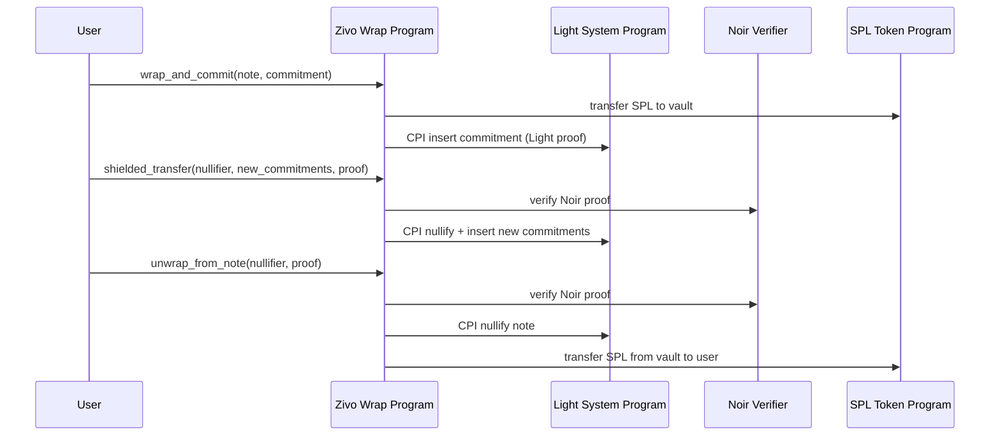

# Zivo Wrap - SPL Token to Inco Token Wrapper

A Solana program that wraps SPL tokens (like USDC) into encrypted Inco tokens using Fully Homomorphic Encryption (FHE).

## Features

- **Wrap**: Convert SPL tokens to encrypted Inco tokens with private balances
- **Unwrap**: Convert encrypted Inco tokens back to SPL tokens
- **1:1 Ratio**: Guaranteed by encrypted operations
- **Secure Vault**: SPL tokens are safely locked in vault PDA
- **Shielded Path (Optional)**: Light Protocol + Noir proofs for unlinkable transfers (additive, not replacing classic wrap/unwrap)

## Installation

### 1. Clone with Submodules

```bash
# Clone the repository with submodules
git clone --recurse-submodules <your-repo-url>

# Or if already cloned, initialize submodules
git submodule update --init --recursive
```

### 2. Install Dependencies

```bash
# Install Rust dependencies (handled by Cargo)
cd zivo-wrap

# Install Node.js dependencies
yarn install
# or
npm install
```

### 3. Required TypeScript Libraries

The following packages are needed for testing:

```json
{
  "@coral-xyz/anchor": "^0.31.1",
  "@solana/web3.js": "^1.95.8",
  "@solana/spl-token": "^0.4.9",
  "@inco/solana-sdk": "^0.0.2",
  "tweetnacl": "^1.0.3"
}
```

### 4. Inco Token Program

The Inco Token Program is already deployed on Solana Devnet:
- **Program ID**: `4cyJHzecVWuU2xux6bCAPAhALKQT8woBh4Vx3AGEGe5N`
- **IDL File**: Included at `idl/inco_token.json`
- **Rust Crate**: Via git submodule at `../lightning-rod-solana`

The submodule is required for Rust program compilation (CPI types).

## Program Architecture

### Vault Structure
- Maps SPL token mint to Inco token mint
- Vault PDA acts as mint authority for Inco tokens
- Holds SPL tokens in a token account

### Instructions

1. **initialize_vault**: Creates vault mapping between SPL and Inco mints
2. **wrap_token**: Transfers SPL tokens to vault, mints encrypted Inco tokens
3. **unwrap_token**: Burns encrypted Inco tokens, returns SPL tokens

## Build & Test

### Build the Program

```bash
anchor build
```

### Run Tests

```bash
anchor test
```

## Usage Flow

### 1. Setup Phase

```typescript
// Create SPL token mint (e.g., mock USDC)
const splMint = await createMint(connection, payer, authority, null, 9);

// Create Inco token mint
const incoMint = Keypair.generate();
await incoTokenProgram.methods
  .initializeMint(9, authority, null)
  .accounts({ mint: incoMint.publicKey, ... })
  .rpc();

// Derive vault PDA
const [vaultPda] = PublicKey.findProgramAddressSync(
  [Buffer.from("vault"), splMint.toBuffer(), incoMint.publicKey.toBuffer()],
  program.programId
);

// Create vault token account
const vaultTokenAccount = await createAccount(
  connection,
  payer,
  splMint,
  vaultPda
);
```

### 2. Initialize Vault

```typescript
await program.methods
  .initializeVault()
  .accounts({
    vault: vaultPda,
    splTokenMint: splMint,
    incoTokenMint: incoMint.publicKey,
    vaultTokenAccount: vaultTokenAccount,
    authority: authority.publicKey,
    systemProgram: SystemProgram.programId,
  })
  .rpc();

// Transfer mint authority to vault
await incoTokenProgram.methods
  .setMintAuthority(vaultPda)
  .accounts({
    mint: incoMint.publicKey,
    currentAuthority: authority.publicKey,
  })
  .rpc();
```

### 3. Wrap Tokens

```typescript
const amount = 100_000_000_000; // 100 tokens

await program.methods
  .wrapToken(new anchor.BN(amount))
  .accounts({
    vault: vaultPda,
    splTokenMint: splMint,
    incoTokenMint: incoMint.publicKey,
    userSplTokenAccount: userSplAccount,
    vaultTokenAccount: vaultTokenAccount,
    userIncoTokenAccount: userIncoAccount,
    user: user.publicKey,
    tokenProgram: TOKEN_PROGRAM_ID,
    systemProgram: SystemProgram.programId,
    incoLightningProgram: INCO_LIGHTNING_PROGRAM_ID,
  })
  .rpc();
```

### 4. Unwrap Tokens

```typescript
const unwrapAmount = 50_000_000_000; // 50 tokens
const encryptedHex = await encryptValue(BigInt(unwrapAmount));

await program.methods
  .unwrapToken(hexToBuffer(encryptedHex), 0, new anchor.BN(unwrapAmount))
  .accounts({
    vault: vaultPda,
    splTokenMint: splMint,
    incoTokenMint: incoMint.publicKey,
    userSplTokenAccount: userSplAccount,
    vaultTokenAccount: vaultTokenAccount,
    userIncoTokenAccount: userIncoAccount,
    user: user.publicKey,
    tokenProgram: TOKEN_PROGRAM_ID,
    systemProgram: SystemProgram.programId,
    incoLightningProgram: INCO_LIGHTNING_PROGRAM_ID,
  })
  .rpc();
```

## Shielded Wrap (Noir + Light Protocol)

This adds a shielded path that uses:
- **Noir** to prove note ownership and action consistency.
- **Light Protocol** to store commitments/nullifiers and fetch validity proofs.

For the full architecture, payload format, and step-by-step flow, see:
- `docs/shielded-wrap-inco-tokens.md`

### Prerequisites

Before using the shielded wrap features, you need to install:

1. **Nargo** (Noir toolchain)
```bash
# Install noirup
curl -L https://raw.githubusercontent.com/noir-lang/noirup/main/install | bash

# Install nargo
noirup
```

2. **Sunspot** (Solana verifier generator)
```bash
# Clone sunspot repository
git clone https://github.com/Lightprotocol/sunspot.git
cd sunspot

# Build the project
cargo build --release

# Add to PATH (optional)
export PATH=$PATH:$(pwd)/target/release
```

3. **Light Protocol SDK**
```bash
# Install Light Protocol dependencies
yarn add @lightprotocol/compressed-token
# or
npm install @lightprotocol/compressed-token
```

### Step-by-Step: Generate and Verify Proofs

#### 1. Write Your Noir Circuit

Create a circuit file (e.g., `shielded_unwrap.nr`):

```rust
fn main(
    // Private inputs
    note_owner: pub Field,
    note_mint: pub Field,
    note_amount: pub Field,
    note_blinding: Field,

    // Public inputs
    nullifier: pub Field,
    commitment: pub Field,
) {
    // Verify note hash matches commitment
    let computed_commitment = poseidon_hash([
        note_owner,
        note_mint,
        note_amount,
        note_blinding
    ]);
    assert(computed_commitment == commitment);

    // Verify nullifier is correctly derived
    let computed_nullifier = poseidon_hash([
        computed_commitment,
        note_blinding
    ]);
    assert(computed_nullifier == nullifier);
}
```

#### 2. Compile the Circuit

```bash
# Navigate to your circuit directory
cd circuits/shielded_unwrap

# Compile the circuit
nargo compile

# This generates:
# - target/shielded_unwrap.json (circuit artifact)
```

#### 3. Generate Solana Verifier

Use Sunspot to generate a Solana program that can verify proofs:

```bash
# Generate verifier program
sunspot create-verifier \
  --circuit target/shielded_unwrap.json \
  --output verifier-program

# Build the verifier
cd verifier-program
anchor build

# Deploy to devnet
anchor deploy --provider.cluster devnet
```

#### 4. Generate Proof Client-Side

```typescript
import { BarretenbergBackend, Noir } from '@noir-lang/noir_js';
import circuit from './target/shielded_unwrap.json';

async function generateProof(inputs: {
  note_owner: string,
  note_mint: string,
  note_amount: string,
  note_blinding: string,
  nullifier: string,
  commitment: string,
}) {
  // Initialize Noir
  const backend = new BarretenbergBackend(circuit);
  const noir = new Noir(circuit, backend);

  // Generate proof
  const { witness } = await noir.execute(inputs);
  const proof = await backend.generateProof(witness);

  return {
    proof: Array.from(proof.proof),
    publicInputs: proof.publicInputs,
  };
}
```

#### 5. Call Zivo Wrap with Proof

```typescript
// Generate the proof
const { proof, publicInputs } = await generateProof({
  note_owner: userPubkey.toBase58(),
  note_mint: incoMint.toBase58(),
  note_amount: "1000000",
  note_blinding: blinding,
  nullifier: computedNullifier,
  commitment: noteCommitment,
});

// Call unwrap_from_note with proof
await program.methods
  .unwrapFromNote(
    Buffer.from(proof),
    publicInputs,
    new anchor.BN(amount)
  )
  .accounts({
    vault: vaultPda,
    splTokenMint: splMint,
    incoTokenMint: incoMint,
    userSplTokenAccount: userSplAccount,
    vaultTokenAccount: vaultTokenAccount,
    user: user.publicKey,
    verifierProgram: VERIFIER_PROGRAM_ID,
    lightSystemProgram: LIGHT_SYSTEM_PROGRAM_ID,
    tokenProgram: TOKEN_PROGRAM_ID,
  })
  .rpc();
```

#### 6. Insert Commitment to Light Protocol

```typescript
import { Rpc, createRpc } from '@lightprotocol/stateless.js';

// Initialize Light RPC
const connection = new Connection(RPC_URL);
const lightRpc = createRpc(RPC_URL, RPC_URL);

// Insert commitment
const signature = await program.methods
  .wrapAndCommit(
    noteCommitment,
    new anchor.BN(amount)
  )
  .accounts({
    // ... accounts
    lightSystemProgram: LIGHT_SYSTEM_PROGRAM_ID,
  })
  .rpc();

// Get proof of inclusion
const proof = await lightRpc.getValidityProof([noteCommitment]);
```

### Environment Setup

Add these to your `.env`:

```bash
# Noir circuit path
NOIR_CIRCUIT_PATH=./circuits/shielded_unwrap/target/shielded_unwrap.json

# Verifier program (deployed from sunspot)
ZK_VERIFIER_PROGRAM_ID=BsDrfmK14jyHR4q1PufBUrjnztoDB4u9ieXZyF8CKbP7

# Light Protocol
LIGHT_SYSTEM_PROGRAM_ID=H5sFv8VwWmjxHYS2GB4fTDsK7uTtnRT4WiixtHrET3bN

# Sunspot/Nargo paths (for server-side proof generation)
NARGO_BIN=/usr/local/bin/nargo
SUNSPOT_BIN=/path/to/sunspot/target/release/sunspot
```

### Common Issues & Troubleshooting

**Issue: "Circuit not found"**
```bash
# Ensure circuit is compiled
cd circuits/shielded_unwrap
nargo compile
```

**Issue: "Verifier program not deployed"**
```bash
# Check verifier program exists on-chain
solana program show <VERIFIER_PROGRAM_ID>
```

**Issue: "Invalid proof"**
- Verify public inputs match between proof generation and verification
- Ensure circuit constraints are satisfied
- Check that commitment/nullifier computation is correct

### Support Status
**Classic wrap/unwrap is still supported** and remains the default path for minting/burning Inco balances.  
The shielded path is additive and can be used in parallel for privacy-focused transfers.

### Flow (Shielded)



### Current Guarantees vs Pending Bindings

**Current guarantees**
- Light commitments and nullifiers are inserted and proven with validity proofs.
- Noir proof enforces note fields (owner, mint, amount, blinding) and nullifier binding.
- SPL transfers are gated by proof verification.

**Pending bindings (MVP gaps)**
- The Light **leaf hash** is not bound to the note hash on-chain.
- The shielded path does not update **Inco confidential balances** yet.
- Full asset consistency between classic wrap/unwrap and shielded notes is not enforced.

### Notes
- A new verifier program must be built and deployed whenever the circuit changes.
- The shielded tests use on-chain Light proofs + Noir proofs generated via `nargo`/`sunspot`.

## Security Considerations

- Vault PDA is the only authority that can mint/burn Inco tokens
- All balances are encrypted using FHE
- SPL tokens are safely locked in vault token account
- 1:1 ratio maintained through encrypted operations

## Program IDs

- **Inco Lightning Program**: `5sjEbPiqgZrYwR31ahR6Uk9wf5awoX61YGg7jExQSwaj`
- **Inco Token Program**: `4cyJHzecVWuU2xux6bCAPAhALKQT8woBh4Vx3AGEGe5N`
- **Zivo Wrap Program**: `22XN9yJRWQv5hAeu3PZCoQvezV82s6LHxxHWk6YjhEH6`
- **ZK Verifier Program**: `EM14vFSXgzAcF3unJgYwXd3QVAWcPhmrNm77dsw1ekg3`

## License

ISC
